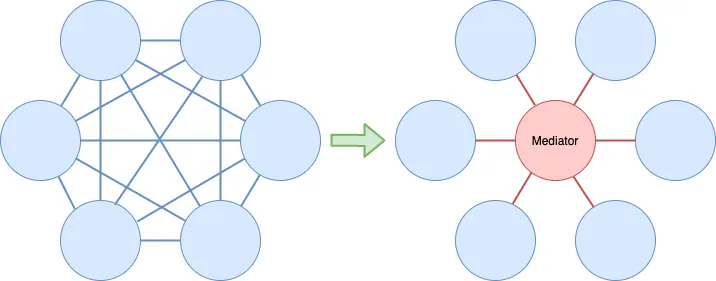

# mediator_design_pattern_flutter

A new Flutter project.

## Getting Started

This project is a starting point for a Flutter application.

A few resources to get you started if this is your first Flutter project:

- [Lab: Write your first Flutter app](https://docs.flutter.dev/get-started/codelab)
- [Cookbook: Useful Flutter samples](https://docs.flutter.dev/cookbook)

For help getting started with Flutter development, view the
[online documentation](https://docs.flutter.dev/), which offers tutorials,
samples, guidance on mobile development, and a full API reference.

## 1. Research: Mediator Design Pattern Flutter

- Keywords:
    - mediator design pattern in flutter
    - mediator design pattern in flutter with example
    - behavioral design patterns in flutter
- Video Title: Mediator Design Pattern in Flutter | Behavioral Design Patterns in Flutter

## 2. Research: Competitors

**Flutter Videos/Articles**

- 8.1K: https://youtu.be/BENMJPCu6gU
- https://medium.com/flutter-community/flutter-design-patterns-22-mediator-575e7aa6bfa9
- https://scottt2.github.io/design-patterns-in-dart/mediator/
- https://dev.to/blazebrain/design-patterns-flutter-9dh

**Android/Swift/React Videos**

- 9.5K: https://youtu.be/YU8fNerur8Q
- 8.1K: https://youtu.be/BENMJPCu6gU
- 111K: https://youtu.be/8DxIpdKd41A
- 10K: https://youtu.be/35D5cBosD4c
- 10K: https://youtu.be/UrFJUcIXTfc
- 2K: https://youtu.be/jYRAAM9STLQ
- 23K: https://youtu.be/KOVc5o5kURE
- 1.5K: https://youtu.be/PSzGs7aVkK8
- 961: https://youtu.be/pz-pq-hf7cA
- https://www.digitalocean.com/community/tutorials/mediator-design-pattern-java
- https://www.baeldung.com/java-mediator-pattern
- https://www.tutorialspoint.com/design_pattern/mediator_pattern.htm
- https://www.geeksforgeeks.org/mediator-design-pattern/
- https://refactoring.guru/design-patterns/mediator/java/example
- https://howtodoinjava.com/design-patterns/behavioral/mediator-pattern/
- https://medium.com/javarevisited/how-to-implement-mediator-design-pattern-using-java-2ab2c901291
- https://refactoring.guru/design-patterns/mediator/swift/example
- https://medium.com/swiftworld/swift-world-design-patterns-mediator-e6b3c35d68b0
- https://github.com/kingreza/Swift-Mediator
- https://dev.to/sergeyleschev/swift-design-patterns-mediator-pattern-4299
- http://www.coursegalaxy.com/design-patterns/mediator-swift.html

**Great Features**

- With the mediator pattern, communication between objects is encapsulated within a mediator
  object. Objects no longer communicate directly with each other, but instead communicate through
  the mediator. This reduces the dependencies between communicating objects, thereby reducing
  coupling.
- It promotes loose coupling between components by encapsulating their interaction within a mediator
  object. This pattern facilitates communication and coordination between objects without them
  directly referencing or depending on each other.

**Problems from Videos**

- NA

**Problems from Flutter Stackoverflow**

- https://stackoverflow.com/questions/9226479/mediator-vs-observer-object-oriented-design-patterns
- https://stackoverflow.com/questions/67764184/mediator-pattern-advantage
- https://stackoverflow.com/questions/481984/fa%C3%A7ade-vs-mediator
- https://stackoverflow.com/questions/25417547/observer-pattern-vs-mediator-pattern

## 3. Video Structure

**Main Points / Purpose Of Lesson**

1. In this video lesson, you will learn how to use mediator design pattern to interact between
   objects with mediator without their direct interaction.
2. Main points:
    - Mediator class
    - Objects
3. Mediator design pattern offers benefits such as encapsulation of communication logic, loose
   coupling between objects, and simplified object interactions. It is particularly useful in
   systems where objects need to interact in a flexible and decoupled manner, and when there is a
   need to manage complex communication patterns.

**The Structured Main Content**

# Prototype Design Pattern

## Definition

Mediator, also known as Intermediary or Controller, is a behavioural design pattern.

Define an object that encapsulates how a set of objects interact. Mediator promotes loose coupling
by keeping objects from referring to each other explicitly, and it lets you vary their interaction
independently.

Communicating objects are called colleagues while the object that controls and coordinates the
interaction is called *drums rolls* the mediator.



Mediator replaces many-to-many (N:M) relationships with one-to-many (1:N) interactions between the
mediator and its colleagues. In general, 1:N relationships are just easier to understand and
maintain.

## Implementation

1. In `main.dart` file, an abstract `Stateful` class with with string `state` is defined:

```dart
abstract interface class Stateful {
  late String state;
}
```

2. Define `Attendee` class which is extending from Stateful class.

```dart
class Attendee extends Stateful {
  String name;

  Attendee(this.name);
}
```

3. Define `Mediator` class with a default constructor having list of stateful class objects.

```dart
class Mediator {
  final List<Stateful> parties;

  Mediator(this.parties);

  void update(String state) {
    for (final party in parties) {
      party.state = state;
    }
  }
}
```

`update(String state)` method will accept new state of type string and it will set the state of list
of stateful class objects with the new state string.

4. In void main() function:
    - Make three Attendee objects with their names.
    - Make a new list `mixer` and add these Attendee objects in that
      list `List<Attendee>.from([curly, larry, moe]);`.
    - Make a new object `publicAnnouncementSystem` from Mediator class and parse mixer list of
      attendee objects here.
    - Now call `update()` method to set the new state of type string in the list of attendee objects
      which are extending from `Stateful` class. Here, attendee object do not interact with each
      other and their state is being updated.
    - Print person.name and person.state for all mixer in the end. `.name` property is from Attendee
      class and `.state` property is from Stateful class.

```dart
void main() {
  final curly = Attendee("Curly");
  final larry = Attendee("Larry");
  final moe = Attendee("I prefer not to disclose my name");
  final mixer = List<Attendee>.from([curly, larry, moe]);
  final publicAnnouncementSystem = Mediator(mixer);

  publicAnnouncementSystem.update("Do NOT eat the shrip tacos!");

  for (final person in mixer) {
    print("${person.name} heard \"${person.state}\".");
  }
  /*
    Curly heard "Do NOT eat the shrip tacos!".
    Larry heard "Do NOT eat the shrip tacos!".
    I prefer not to disclose my name heard "Do NOT eat the shrip tacos!".
  */
}
```

**Difference between Mediator and Command**:
The Mediator is about the interactions between "colleague" objects who don't know each other. The
Command is about how to execute one specific interaction (whether the command is created by a Player
or by a mediator).
